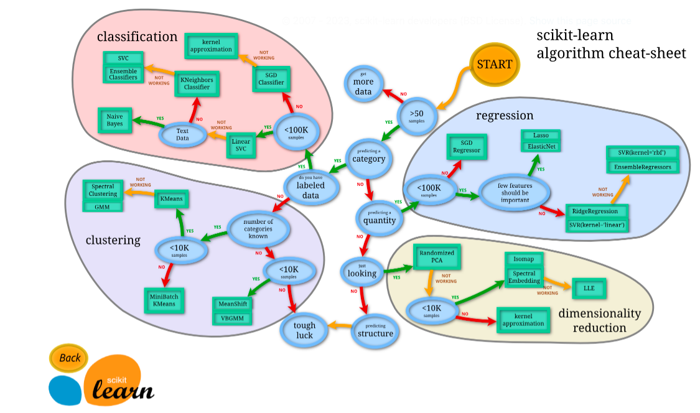

<!-- command Kv for live  -->

<!-- HEADER -->
<br>
<header align="center">
   <br/> <br/>
  <h1 align="center">Projets Data Scientist</h1>
  <p align="center">
    Machine Learning
  </p>
</header>


<!-- TABLE OF CONTENTS -->

  <summary>Table De Matière</summary>
  <ol>
    <li>
      <a href="#about-the-project">Présentations Des Chapitres</a>
      <ul>
          <li><a href="#built-with">Chapitre 1: Les Bases Du Langague Python </a></li>
         <li><a href="#built-with">Chapitre 2: Le Calcul Numèrique</a></li>
         <li><a href="#built-with">Chapitre 3 Visualisation des données</a></li>
         <li><a href="#built-with">Chapitre 4: Preprocessing</a></li>
         <li><a href="#built-with">Chapitre 5: Régression Linèaire</a></li>
         <li><a href="#built-with">Chapitre 6: Initiation à l'apprentissage supervisé</a></li>
         <li><a href="#built-with">Chapitre 7: Apprentissage Non supervisé</a></li>
        </ul>
    </li>
    <li>
      <a href="#getting-started">Pour Commencer</a> 
    </li>
   <li><a href="#built-with">Langages utilisés </a></li>
    <li><a href="#contact">Contact</a></li>
 </li>
  </ol>

<!-- ABOUT THE PROJECT -->
## Présentations Des Chapitres

 <br><div align="center"></div><br>

## Chapitre 1: Les Bases Du Langague Python 

Le 1er chapitre contient Les bases du langage Python.

## Chapitre 2: Le Calcul Numèrique
-*Numpy et pandas*-

Les deux packages principaux pour manipuler des données sont NumPy et Pandas. Le premier chapitre contient l'utilisation des trois structures de base de ces packages que sont les ndarray de NumPy et les Series et DataFrame de Pandas.


## Chapitre 3: Visualisation des données 
-*matplotlib et seaborn*-
  
De nombreux packages sont disponibles en Python pour représenter des donnéesde manière attractive.

**Matplotlib** est le plus connu est et sert de base à de nombreux autres packages.C'est un package complet pour la data visualisation. Il est basé sur la construction de graphiques en utilisant des commandes simples.

**Seaborn** est un autre package intéressant pour la création de graphiques. Il est basé sur Matplotlib. Son principal intérêt réside dans la création de graphiques plus spécifiques en quelques lignes de code.

## Chapitre 4: Preprocessing

Le bruit altère les données collectées et risque de rendre difficile l’apprentissage de la relation que l’on cherche à prédire, voire de rendre la modélisation impossible.

Dans l’immense majorité des problèmes réels, la collecte des données est confrontée à une voire plusieurs formes de bruits. Ces bruits peuvent être d’origine « matérielle » (bruit blanc dans les signaux électriques, bruit au sens acoustique, etc.), d’imprécision ou de défaut dans les mesures issues de capteurs, d’approximation dans les données ou encore de données manquantes car non mesurées. Dans ce chapitre Nous traitons des données bruité dimenssion 1,2 afin d'enlever le bruit en utilisant la transformé de fourier ainsi que le filtrage pour les images.

## Chapitre 5: Régression Linèaire

La régression linéaire simple sert à trouver unne relation d’une variable de sortie (continue) par rapport à une autre.
Les étapes pour créer un algorihme d'apprentissage basé sur la régression avec python sont:

- Génération de données aléatoires avec une tendance linéaire.
  
- Création de la matrice X qui contient la colonne de Biais.
  
- Création d'un vecteur parametre $\theta$, initialisé avec des coefficients aléatoires.
  
- Implementation d'un modele $F = X.\theta$.
  
- La mesure des erreurs du modele sur le Dataset X, y en implémenterl'erreur quadratique moyenne.
  
- Implementation la formule du gradient pour la **MSE**
  
- définition d'un **nombre d'itérations**, ainsi qu'un **pas d'apprentissage $\alpha$**.

- Une fois le modele entrainé, on observe les resultats par rapport a notre Dataset.

- Tracage de la courbe d'apprentissage afin de vérifier si notre algorithme de Descente de gradient a bien fonctionné, on observe l'évolution de la fonction cout a travers les itérations.

- Evaluation finale pour évaluer la réelle performance du modele avec une métrique populaire (pour votre patron, client, ou vos collegues) on peut utiliser le **coefficient de détermination**,

$\frac{\partial J(\theta) }{\partial \theta} = \frac{1}{m} X^T.(X.\theta - y)$

Ensuite on utilise cette fonction dans la descente de gradient:

$\theta = \theta - \alpha \frac{\partial J(\theta) }{\partial \theta}$

## Chapitre 6: Initiation à l'apprentissage supervisé

La régression est un autre type de méthode d’apprentissage supervisé qui utilise un algorithme pour comprendre la relation entre les variables dépendantes et indépendantes. Les modèles de régression sont utiles pour prédire des valeurs numériques sur la base de différents points de données. Les algorithmes de régression sont par exemple la régression linéaire, la régression logistique et la régression polynomiale.

Les problèmes de classification utilisent un algorithme pour affecter avec précision des données de test à des catégories spécifiques. Les algorithmes d’apprentissage supervisé peuvent être utilisés pour classer les spams dans un dossier distinct de sa boîte de réception par exemple. Les classifieurs linéaires, les machines à vecteurs de support, les arbres de décision et les forêts d’arbres décisionnels sont tous des types courants d’algorithmes de classification.


## Chapitre 7: Apprentissage Non supervisé

L’apprentissage non supervisé utilise des algorithmes de machine learning pour analyser et regrouper des ensembles de données non étiquetées. Ces algorithmes découvrent des modèles cachés dans les données sans nécessiter d’intervention humaine.

Le clustering est une technique d’exploration de données permettant de regrouper des données non étiquetées en fonction de leurs similitudes ou de leurs différences. Cette technique est utile pour la segmentation de marché, la compression d’images, etc.


<p align="right">(<a href="#readme-top">Revenir en haut</a>)</p>

<!-- GETTING STARTED -->
## Pour Commencer

Pour avoir ce projet veuillez copier le dossier comme suit:

```sh
  git clone https://github.com/med063197Data-Scientist.git

  ```

## Languages utilisés

Le type fichier que j'utilise dans mes projets est notebook *.ipynb*. Vous pouvez utiliser anaconda en installant tout ce que je vous ai mis en bas.
<ul>
    <li> 
    <a href='https://www.python.org/' target="_blank"></a> 
    </li>

  <li>
 <a href='https://docs.anaconda.com/anaconda/install/index.html' target="_blank"></a>
    </li>
    <li>
    <a href='https://anaconda.org/anaconda/numpy' target="_blank"></a>
    </li>
    <li>
    <a href='https://anaconda.org/anaconda/pandas' target="_blank"></a>
    </li>
    <li>
    <a href='https://anaconda.org/anaconda/matplotlib' target="_blank"></a>
    </li>
    <li>
    <a href='https://anaconda.org/anaconda/scikit-learn' target="_blank"></a>
    </li>
     
</ul>


<!-- CONTACT -->
## Contact

CHERIF MOHAMED - CherifMohamedAmineUnivFce@gmail.com

Lien Des Projets: [https://github.com/mohamed063197/Data-Scientist](https://github.com/mohamed063197/data-Scientist)

<p align="right">(<a href="#readme-top">Retour en haut</a>)</p>

